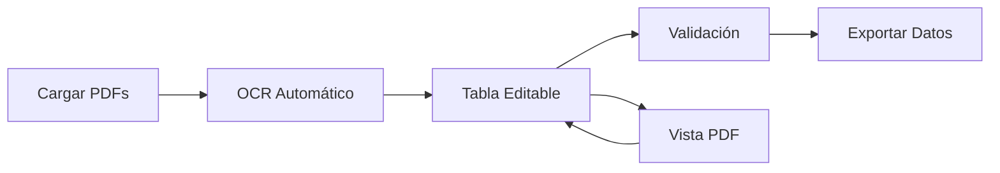
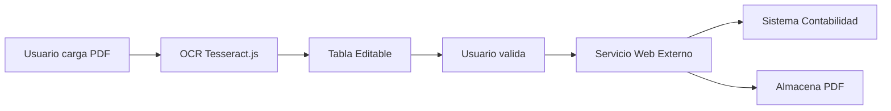

# 📋 Sistema de Gestión de Facturas - Diputación de Sevilla

## 🎯 Visión del Producto

Sistema web para digitalizar y procesar facturas en papel de la Diputación de Sevilla, extrayendo automáticamente datos mediante OCR y facilitando su grabación en el sistema de contabilidad.

---

## 👥 Usuarios

### Usuario Principal: Administrativo de Contabilidad
- **Necesidad**: Procesar facturas en papel de forma eficiente
- **Pain Point**: Grabación manual lenta y propensa a errores
- **Objetivo**: Reducir tiempo de procesamiento de facturas en un 70%

---

## 🎨 Flujo de Usuario (User Journey)



### Paso a Paso

1. **Carga de Archivos**
   - Usuario selecciona múltiples PDFs desde su ordenador
   - Sistema muestra progreso de carga
   - Validación: Solo archivos PDF, máximo 50MB por archivo

2. **Procesamiento OCR**
   - Sistema extrae texto de cada PDF automáticamente
   - Muestra indicador de progreso por archivo
   - Guarda texto extraído para análisis

3. **Visualización en Tabla**
   - Tabla tipo hoja de cálculo con una fila por factura
   - Columnas según campos obligatorios legales
   - Celdas editables para correcciones manuales

4. **Vista de PDF**
   - Panel lateral (1/3 del ancho) con visor de PDF
   - Al hacer clic en fila de tabla, muestra PDF correspondiente
   - Zoom y navegación de páginas

5. **Validación y Exportación**
   - Validación de campos obligatorios
   - Exportación a formato compatible con sistema contable

---

## 📊 Modelo de Datos

### Entidad: Invoice (Factura)

> **Campos obligatorios según normativa española** (Ley 58/2003 y Real Decreto 1619/2012)

```typescript
interface Invoice {
  id: string;
  
  // Archivo PDF
  pdfFileName: string;
  pdfUrl: string;              // URL temporal (no se guarda en BD)
  ocrText: string;             // Texto extraído por OCR
  
  // 1. Identificación del Emisor (Obligatorio)
  supplierName: string;        // Nombre o razón social
  supplierNIF: string;         // NIF/DNI/CIF
  supplierAddress: string;     // Domicilio completo
  
  // 2. Identificación del Receptor (Obligatorio)
  receiverName: string;        // Diputación de Sevilla
  receiverNIF: string;         // NIF de la Diputación
  receiverAddress: string;     // Domicilio de la Diputación
  
  // 3. Número y Serie de la Factura (Obligatorio)
  invoiceNumber: string;       // Número único y correlativo
  invoiceSeries?: string;      // Serie (opcional pero recomendado)
  
  // 4. Fecha de Expedición (Obligatorio)
  invoiceDate: Date;           // Fecha de emisión
  
  // 5. Descripción Detallada (Obligatorio)
  description: string;         // Descripción de bienes/servicios
  units?: number;              // Unidades (opcional)
  unitPrice?: number;          // Precio unitario (opcional)
  concept: string;             // Concepto detallado
  
  // 6. Base Imponible (Obligatorio)
  baseAmount: number;          // Importe total antes de impuestos
  
  // 7. Tipos Impositivos y Cuotas (Obligatorio)
  vatRate: number;             // Tipo de IVA (%) - ej: 21, 10, 4
  vatAmount: number;           // Cuota de IVA
  irpfRate?: number;           // Retención IRPF (%) - opcional
  irpfAmount?: number;         // Cuota de IRPF - opcional
  
  // 8. Importe Total (Obligatorio)
  totalAmount: number;         // Base + IVA - IRPF
  
  // Metadatos del Sistema
  status: 'pending' | 'validated' | 'exported';
  createdAt: Date;
  updatedAt: Date;
  userId: string;              // Usuario que procesó
  exportedAt?: Date;           // Fecha de envío al servicio web
}
```

---

## 🏗️ Arquitectura Técnica

### Stack (Golden Path)

| Capa | Tecnología | Justificación |
|------|------------|---------------|
| Frontend | Next.js 16 + React 19 + TypeScript | Full-stack, Turbopack |
| Estilos | Tailwind CSS 3.4 + shadcn/ui | Componentes premium + diseño corporativo |
| Backend | Supabase (PostgreSQL) | Auth + DB (sin Storage, PDFs no se guardan) |
| OCR | Tesseract.js (cliente) | 200 facturas/mes = volumen bajo, gratis |
| PDF Viewer | react-pdf | Visor nativo en navegador |
| Validación | Zod | Type-safe validation |
| Estado | Zustand | State management minimal |
| Integración | Axios/Fetch | Llamadas al servicio web externo |

### Flujo de Datos



**Decisión clave**: Los PDFs **NO se guardan en Supabase Storage**. Se envían directamente al servicio web externo junto con los datos validados.

### Arquitectura Feature-First

```
src/
├── app/
│   ├── (auth)/
│   │   ├── login/
│   │   └── register/
│   └── (main)/
│       ├── dashboard/
│       └── invoices/
│
├── features/
│   ├── auth/
│   │   ├── components/
│   │   ├── hooks/
│   │   └── services/
│   │
│   ├── invoice-upload/
│   │   ├── components/
│   │   │   ├── FileDropzone.tsx
│   │   │   └── UploadProgress.tsx
│   │   ├── hooks/
│   │   │   └── useFileUpload.ts
│   │   └── services/
│   │       └── uploadService.ts
│   │
│   ├── invoice-ocr/
│   │   ├── services/
│   │   │   ├── ocrService.ts
│   │   │   └── textParser.ts
│   │   └── types/
│   │       └── ocr.types.ts
│   │
│   ├── invoice-table/
│   │   ├── components/
│   │   │   ├── InvoiceTable.tsx
│   │   │   ├── EditableCell.tsx
│   │   │   └── TableToolbar.tsx
│   │   ├── hooks/
│   │   │   └── useInvoiceTable.ts
│   │   └── store/
│   │       └── invoiceStore.ts
│   │
│   └── pdf-viewer/
│       ├── components/
│       │   ├── PDFViewer.tsx
│       │   └── PDFControls.tsx
│       └── hooks/
│           └── usePDFViewer.ts
│
└── shared/
    ├── components/
    │   ├── ui/          # shadcn/ui components
    │   └── layout/
    ├── lib/
    │   ├── supabase.ts
    │   └── utils.ts
    └── types/
        └── invoice.types.ts
```

---

## 🔐 Seguridad y Permisos

### Autenticación
- **Método**: Email/Password (Supabase Auth)
- **Roles**: 
  - `admin`: Acceso completo
  - `user`: Solo sus propias facturas

### Row Level Security (RLS)

```sql
-- Usuarios solo ven sus propias facturas
CREATE POLICY "Users can view own invoices"
ON invoices FOR SELECT
USING (auth.uid() = user_id);

-- Usuarios solo pueden insertar con su propio user_id
CREATE POLICY "Users can insert own invoices"
ON invoices FOR INSERT
WITH CHECK (auth.uid() = user_id);

-- Usuarios solo pueden actualizar sus propias facturas
CREATE POLICY "Users can update own invoices"
ON invoices FOR UPDATE
USING (auth.uid() = user_id);
```

---

## 🔌 Integración con Servicio Web Externo

### Descripción

El sistema **NO almacena PDFs localmente**. Una vez que el usuario valida los datos en la tabla, se realiza una llamada a un servicio web externo que:

1. ✅ Graba los datos de la factura en el sistema de contabilidad
2. ✅ Almacena el PDF asociado al registro de la factura

### Contrato de API (Pendiente de definir)

```typescript
// Endpoint esperado
POST /api/invoices/submit

// Request Body
{
  invoiceData: Invoice,      // Datos de la factura validados
  pdfFile: File | Blob       // Archivo PDF en formato base64 o multipart
}

// Response Success
{
  success: true,
  invoiceId: string,         // ID asignado por el sistema contable
  message: "Factura registrada correctamente"
}

// Response Error
{
  success: false,
  error: string,
  details?: string[]
}
```

### Manejo de Errores

- **Timeout**: 30 segundos máximo por llamada
- **Reintentos**: 3 intentos automáticos con backoff exponencial
- **Fallback**: Si falla, guardar en cola local para reintento manual
- **Validación previa**: Verificar campos obligatorios antes de enviar

### Seguridad

- **Autenticación**: Token JWT o API Key (a definir)
- **HTTPS**: Obligatorio
- **Validación**: Firma digital de los datos (opcional)

---

## 🎨 Diseño UI/UX

> **PENDIENTE**: El usuario proporcionará archivos HTML y PNG con el diseño corporativo de la Diputación de Sevilla

### Layout Principal

```
┌─────────────────────────────────────────────────────────────┐
│ Header: Logo Diputación | Usuario | Logout                  │
├─────────────────────────────────────────────────────────────┤
│                                                               │
│ ┌─────────────────────────────────────────────────────────┐ │
│ │ 📤 Cargar Facturas (Dropzone)                           │ │
│ └─────────────────────────────────────────────────────────┘ │
│                                                               │
│ ┌───────────────────────────┬───────────────────────────┐   │
│ │                           │                           │   │
│ │  TABLA DE FACTURAS        │   VISOR PDF               │   │
│ │  (2/3 del ancho)          │   (1/3 del ancho)         │   │
│ │                           │                           │   │
│ │  - Fila seleccionable     │   - Zoom in/out           │   │
│ │  - Celdas editables       │   - Navegación páginas    │   │
│ │  - Validación inline      │   - Descarga              │   │
│ │                           │                           │   │
│ └───────────────────────────┴───────────────────────────┘   │
│                                                               │
│ ┌─────────────────────────────────────────────────────────┐ │
│ │ 💾 Exportar a CSV | 📊 Estadísticas                     │ │
│ └─────────────────────────────────────────────────────────┘ │
└─────────────────────────────────────────────────────────────┘
```

### Paleta de Colores

```css
/* Institucional Diputación de Sevilla */
--primary: #003366;      /* Azul institucional */
--secondary: #FFD700;    /* Dorado */
--accent: #00A86B;       /* Verde validación */
--error: #DC2626;        /* Rojo error */
--background: #F8FAFC;   /* Gris claro */
--surface: #FFFFFF;      /* Blanco */
```

---

## 🚀 Fases de Implementación

### Fase 1: MVP (Minimum Viable Product)
**Objetivo**: Sistema funcional básico en 2 semanas

- [ ] Setup proyecto con SaaS Factory
- [ ] Autenticación (Email/Password)
- [ ] Carga de archivos PDF
- [ ] OCR básico (Tesseract.js)
- [ ] Tabla editable con campos obligatorios
- [ ] Visor PDF lateral
- [ ] Exportación a CSV

### Fase 2: Mejoras (Semana 3-4)

- [ ] Validación automática de campos
- [ ] Parsing inteligente de OCR (regex patterns)
- [ ] Búsqueda y filtros en tabla
- [ ] Historial de cambios
- [ ] Estadísticas básicas

### Fase 3: Optimización (Semana 5-6)

- [ ] OCR mejorado (API externa si es necesario)
- [ ] Batch processing (múltiples PDFs en paralelo)
- [ ] Exportación a formatos contables específicos
- [ ] Notificaciones y alertas
- [ ] Backup automático

---

## 📋 Campos Obligatorios Legales

✅ **Confirmado según normativa española** (Ley 58/2003 y Real Decreto 1619/2012)

### Datos Obligatorios de la Factura:

1. **Identificación del Emisor y Receptor**
   - Nombre o razón social
   - NIF/DNI
   - Domicilio completo

2. **Número y Serie de la Factura**
   - Único y correlativo

3. **Fecha de Expedición**
   - Fecha en que se emite

4. **Descripción Detallada**
   - De los bienes o servicios
   - Incluyendo unidades, precio unitario y concepto

5. **Base Imponible**
   - Importe total antes de impuestos

6. **Tipos Impositivos y Cuotas**
   - Desglose de IVA y/o retenciones (IRPF) aplicadas

7. **Importe Total**
   - Suma de base imponible más impuestos

---

## 🧪 Testing

### Casos de Prueba Críticos

1. **Carga de archivos**
   - ✅ Carga exitosa de PDF válido
   - ✅ Rechazo de archivos no-PDF
   - ✅ Rechazo de archivos >50MB
   - ✅ Carga múltiple (5+ archivos)

2. **OCR**
   - ✅ Extracción correcta de texto limpio
   - ✅ Manejo de PDFs escaneados
   - ✅ Manejo de PDFs con imágenes

3. **Tabla**
   - ✅ Edición inline de celdas
   - ✅ Validación de campos obligatorios
   - ✅ Selección de fila actualiza visor PDF

4. **Exportación**
   - ✅ CSV con formato correcto
   - ✅ Todos los campos incluidos
   - ✅ Encoding UTF-8

---

## 📊 Métricas de Éxito

| Métrica | Objetivo |
|---------|----------|
| Tiempo de procesamiento por factura | < 30 segundos |
| Precisión OCR | > 90% |
| Reducción tiempo vs. manual | > 70% |
| Tasa de error en validación | < 5% |
| Satisfacción usuario | > 8/10 |

---

## ❓ Preguntas Pendientes

1. **OCR**: ¿Qué volumen mensual de facturas se procesará? (Para decidir entre Tesseract.js local o API externa)
Se calcula unas 200 facturas por mes.
2. **Campos**: ¿Lista completa de campos obligatorios según normativa?
Datos Obligatorios de la Factura:
Identificación del Emisor y Receptor: Nombre o razón social, NIF/DNI y domicilio completo.
Número y Serie de la Factura: Único y correlativo.
Fecha de Expedición: Fecha en que se emite.
Descripción Detallada: De los bienes o servicios, incluyendo unidades, precio unitario y concepto.
Base Imponible: Importe total antes de impuestos.
Tipos Impositivos y Cuotas: Desglose de IVA y/o retenciones (IRPF) aplicadas.
Importe Total: Suma de base imponible más impuestos. 
3. **Integración**: ¿Formato específico de exportación para el sistema contable actual?
se llamara a un servicio web que se encarga de grabar los datos correctos, una vez validados por el usuario del programa en la aplicación de contabilidad y también enviará el pdf en el mismo servicio para que ademas de registrar los datos de la factura, incorpore el pdf en el registro de la factura.
4. **Usuarios**: ¿Cuántos usuarios concurrentes se esperan?
Seran menos de 5 usuarios concurrentes.
5. **Almacenamiento**: ¿Política de retención de PDFs? (¿Cuánto tiempo se guardan?)
Los archivos pdf no se deben guardar en local, ya que se llamará a un servicio web que se encarga de grabar los datos correctos, una vez validados por el usuario del programa en la aplicación de contabilidad y también enviará el pdf en el mismo servicio para que ademas de registrar los datos de la factura, incorpore el pdf en el registro de la factura.
---

## 🔄 Próximos Pasos

1. **Validar este documento** con el usuario
2. **Responder preguntas pendientes**
3. **Generar PRP** (Product Requirements Proposal) detallado
4. **Iniciar Fase 1** del desarrollo

---

**Documento generado por**: SaaS Factory V3
**Fecha**: 2026-01-17
**Versión**: 1.0
